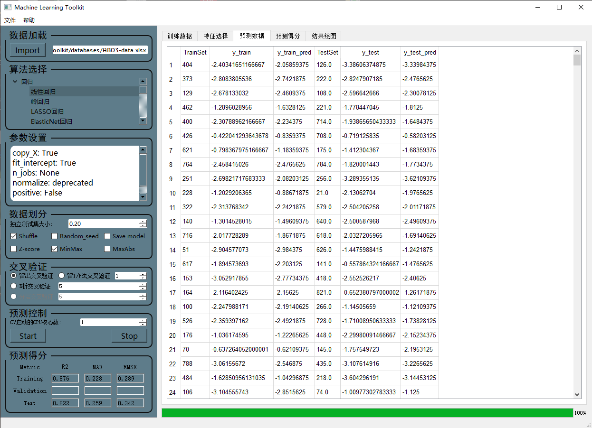

# Machine-Learning-Toolkit

该项目是一个用于实现各种机器学习算法预测的 GUI 框架。



<div class="language-selector">
  <a href="README.md">English</a>
  <a href="README-zh.md">中文</a>
</div>

## 目录

- [项目介绍](#项目介绍)
- [主要功能](#主要功能)
- [依赖条件](#依赖条件)
- [项目内容](#项目内容)
- [安装](#安装)
- [使用](#使用)
- [贡献者](#贡献者)
- [许可证](#许可证)
- [致谢](#致谢)


## 项目介绍

Machine Learning Toolkit 是一个用于实现各种机器学习算法预测的GUI框架，可以使用各种机器学习算法对数据进行预测，支持常见的回归、分类、聚类和降维算法。该项目使用 PyQt5 框架和 Python 语言编写，具有以下主要功能：

## 主要功能

- **导入数据**：用户可以将自己的数据导入到 GUI 中进行处理。

- **归一化处理**：用户可以选择是否对输入数据进行归一化处理，并提供了多种常见的数据归一化方法可供选择。

- **数据划分**：用户可以设置训练集和独立测试集的数据划分比例，并设置是否在划分训练集/测试集之前将数据随机打乱以及设置随即种子保证每次划分的可重复性。

- **选择算法**：根据项目需求选择不同的机器学习算法，包括回归、分类、聚类和降维等算法。

- **修改超参数**：用户可以修改机器学习模型的超参数，以达到更好的预测效果。

- **交叉验证**：用户可以选择是否进行交叉验证，提供了多种交叉验证方法，如：K折交叉验证、留一法交叉验证、留P法交叉验证、分层交叉验证等。

- **CPU核心数**：用户可以设置训练模型时使用的 CPU 核心数。

- **保存模型**：用户可以选择是否保存训练好的机器学习模型。

- **预测结果分析**：用户可以预览训练机器学习模型的预测结果数据和各种常见的预测得分指标，并对预测结果进行各种可视化绘图分析。

该项目旨在为机器学习初学者和专业人士提供一个强大的工具，帮助他们快速轻松地实现机器学习模型，并分析和优化模型性能。

## 依赖条件

- Python 3.x

- Python包依赖请参见 requirements.txt 文件

## 项目内容

项目中的文件结构应该是这样：

```
Machine-Learning-Toolkit
├── __pycache__：Python编译后自动生成的文件夹
├── databases：数据文件夹，用于存放导入的数据文件
├── figures：图表文件夹，用于存放生成的图表
├── icon：图标文件夹，存放软件图标
├── model：模型文件夹，存放训练好的模型文件
├── ML_GUI.ui：PyQt5设计的GUI界面文件
├── Ui_ML_GUI.py：通过PyQt5将ML_GUI.ui转化为python代码生成的文件
├── main.py：主程序文件
├── requirements.txt：Python环境依赖库文件
├── README.md：项目介绍文件（英文）
├── README-zh.md：项目介绍文件（中文）
└── LICENSE：MIT许可证文件
```

## 安装

1. 克隆仓库到本地：

```bash
git clone https://github.com/yourusername/Machine-Learning-Toolkit.git
```

2. 进入项目目录：

```bash
cd Machine-Learning-Toolkit
```

3. 安装依赖：

```bash
pip install -r requirements.txt
```

4. 运行项目：
```bash
python main.py
```

## 使用

1. **导入数据**：点击导入数据按钮，选择要导入的数据文件。

2. **数据归一化**：在数据归一化区域中选择是否对输入数据进行归一化处理。

3. **随机打乱数据**：在数据划分区域中选择是否在划分训练集/测试集之前将数据随机打乱，设置随机种子保证每次划分的可重复性，点击运行按钮即可。

4. **设置数据划分比例**：在数据划分区域中设置训练集和测试集的数据划分比例，点击运行按钮即可。

5. **选择算法**：在算法选择区域中选择想要使用的算法，点击运行按钮即可。

6. **修改超参数**：在超参数区域中修改超参数，点击运行按钮即可。

7. **保存模型**：在保存模型区域中选择是否保存模型，选择保存路径，点击运行按钮即可。

8. **查看结果**：在预测结果窗口中可以看到源数据和预测数据以及各项预测评估指标。

## 贡献者

- [Yihang Li](https://www.x-mol.com/groups/flygroup/people/18563)

我们非常欢迎您为该项目做出贡献。如果您发现了任何问题或有任何建议，请在 Issues 中提交问题或 Pull Request 进行更改。

## 许可证

该项目基于 MIT 许可证 发布，允许任何人使用、复制、修改、合并、出版、分发、再许可和/或销售本软件的副本，但需遵守以下条件：

- 在软件和文档中包含版权声明和许可声明。
- 在所有的副本中都包含上述版权声明和许可声明。
- 不得使用作者的名字、商标或其他形式的认可来促销或推广本软件。

## 致谢

我们感谢以下开源项目和库，它们对该项目的开发和实现提供了帮助和支持：

- Pyqt5

- Pandas

- Scikit-learn

- Matplotlib

如果您喜欢该项目，请给我们一个star支持，谢谢！