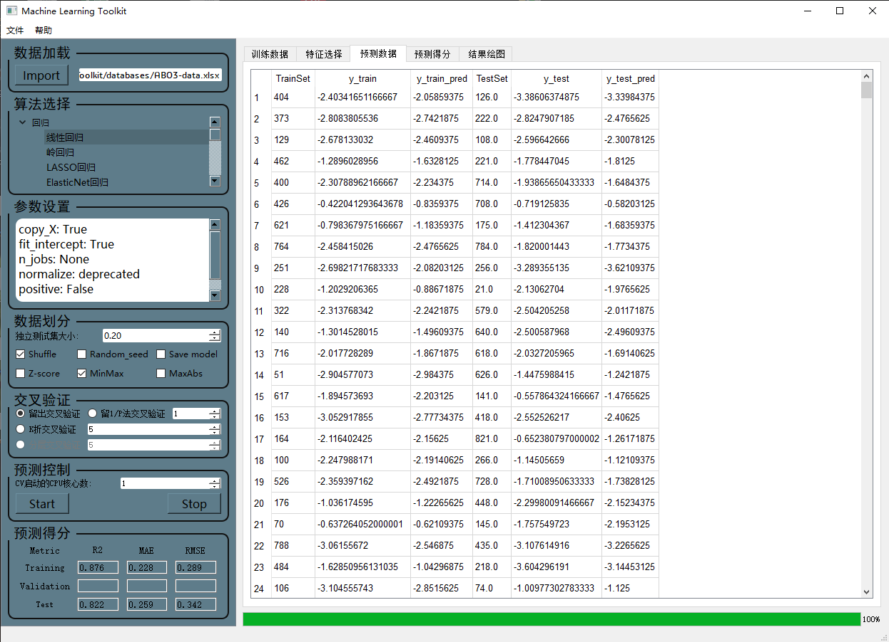

# Machine-Learning-Toolkit

This project is a GUI framework for implementing various machine learning algorithms for prediction.



<div class="language-selector">
  <a href="README.md">English</a>
  <a href="README-zh.md">中文</a>
</div>

## Table of Contents

- [Introduction](#introduction)
- [Main Features](#main-features)
- [Prerequisites](#prerequisites)
- [Project Content](#project-content)
- [Installation](#installation)
- [Usage](#usage)
- [Contributors](#contributors)
- [License](#license)
- [Acknowledgments](#acknowledgments)


## Introduction

Machine Learning Toolkit is a GUI framework for implementing various machine learning algorithms for prediction. It supports common regression, classification, clustering, and dimensionality reduction algorithms. This project is written in Python language and PyQt5 framework, and has the following main features:

## Main Features

- **Import Data**: Users can import their own data into the GUI for processing.

- **Normalization**: Users can choose whether to normalize the input data and provide multiple common data normalization methods for selection.

- **Data Split**: Users can set the data split ratio of the training set and the independent test set, and set whether to randomize the data before splitting the training set/test set and set a random seed to ensure the repeatability of each split.

- **Select Algorithm**: Choose different machine learning algorithms according to project requirements, including regression, classification, clustering, and dimensionality reduction algorithms.

- **Modify Hyperparameters**: Users can modify the hyperparameters of the machine learning model to achieve better prediction results.

- **Cross-validation**: Users can choose whether to perform cross-validation and provide multiple cross-validation methods, such as K-fold cross-validation, leave-one-out cross-validation, leave-P-out cross-validation, and stratified cross-validation.

- **CPU Cores**: Users can set the number of CPU cores used when training the model.

- **Save Model**: Users can choose whether to save the trained machine learning model.

- **Predictive Result Analysis**: Users can preview the predictive result data of the trained machine learning model and various common predictive score indicators, and perform various visualization and analysis of the predictive result.

This project aims to provide a powerful tool for machine learning beginners and professionals to help them quickly and easily implement machine learning models and analyze and optimize model performance.

## Prerequisites

- Python 3.x

- For Python package dependencies, please refer to the requirements.txt file

## Project Content

The file structure in the project should be as follows:

```
Machine-Learning-Toolkit
├── __pycache__
├── databases
├── figures
├── icon
├── model
├── ML_GUI.ui
├── Ui_ML_GUI.py
├── main.py
├── requirements.txt
├── README.md
├── README-zh.md
├── LICENSE
```

Here are the brief introductions of each item in the "Machine-Learning-Toolkit" project:

- **pycache**: This directory contains the compiled bytecode of the Python files.

- **databases**: This directory contains the sample datasets that can be used for testing and training purposes.

- **figures**: This directory contains the figures generated during the model training and prediction process.

- **icon**: This directory contains the icon used for the application interface.

- **model**: This directory contains the trained models that can be used for prediction purposes.

- **ML_GUI.ui**: This file is the user interface designed in the Qt Designer tool.

- **Ui_ML_GUI.py**: This file is the Python code generated by converting the ML_GUI.ui file.

- **main.py**: This file is the main program that integrates all the functions and runs the application.

- **requirements.txt**: This file lists all the Python package dependencies required for running the application.

- **README.md**: This file is the English version of the project README file that provides an overview of the project.

- **README-zh.md**: This file is the Chinese version of the project README file that provides an overview of the project.

- **LICENSE**: This file contains the license terms under which the project is distributed.

## Installation

1. Clone the repository to your local machine:

```bash
git clone https://github.com/yourusername/Machine-Learning-Toolkit.git
```

2. Navigate to the project directory:

```bash
cd Machine-Learning-Toolkit
```

3. Install dependencies:

```bash
pip install -r requirements.txt
```

4. Run the project:

```bash
python main.py
```

## Usage

1. **Import Data**: Click the Import Data button and select the data file to import.

2. **Normalize Data**: Select whether to normalize the input data in the Data Normalization area.

3. **Randomize Data**: Select whether to randomize the data before splitting the training set/test set in the Data Split area, set a random seed to ensure the repeatability of each split, and click the Run button.

4. **Set Data Split Ratio**: Set the data split ratio of the training set and test set in the Data Split area, and click the Run button.

5. **Select Algorithm**: Choose the algorithm you want to use in the Algorithm Selection area and click the Run button.

6. **Modify Hyperparameters**: Modify the hyperparameters in the Hyperparameter area and click the Run button.

7. **Save Model**: Choose whether to save the model in the Save Model area, select the save path, and click the Run button.

8. **View Results**: In the Prediction Results window, you can see the source data and predicted data as well as various predictive evaluation indicators.

## Contributors

- [Yihang Li](https://www.x-mol.com/groups/flygroup/people/18563)

We welcome contributions to this project. If you find any issues or have any suggestions, please submit them in the Issues or create a Pull Request to make changes.

## License

This project is licensed under the MIT License. See the LICENSE file for details.

## Acknowledgments

We would like to thank the following open-source projects and libraries for their help and support in the development and implementation of this project:

- Pyqt5

- Pandas

- Scikit-learn

- Matplotlib

If you like this project, please give us a star to show your support. Thank you!